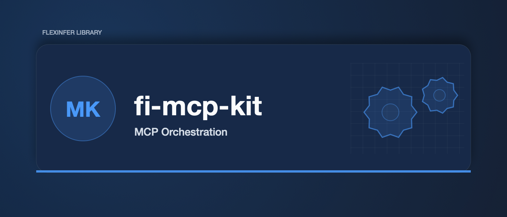

# fi-mcp-kit


[](https://gitlab.flexinfer.ai/libs/fi-mcp-kit/-/commits/main)

Enterprise-grade orchestration toolkit for the Model Context Protocol (MCP).

## Overview

`fi-mcp-kit` provides the infrastructure layer for managing MCP deployments, including:

- **Registry-First Configuration**: Define tool availability and server endpoints via standard `registry.yaml`
- **Configuration Generation**: Auto-generate connection configs for Example Client, VSCode, and other clients
- **Deployment Orchestration**: Generate Kubernetes manifests for scalable MCP server hubs (Sidecar or Centralized patterns)
- **Secret Abstractions**: Unified interface for injecting secrets into MCP environments

## Components

### Core Packages

- `pkg/registry`: Registry schema validation and loading
- `pkg/generator`: Client configuration generators
- `pkg/secrets`: Secret injection providers (Env, File, Vault)

### CLI

The `fi-mcp` command-line tool allows you to:

```bash
# Validate a registry file
fi-mcp registry validate --registry config/registry.yaml

# Generate client configs
fi-mcp gen configs --registry config/registry.yaml --output .config/ --target example_client

# Generate Kubernetes manifests
fi-mcp gen manifests --registry config/registry.yaml --output k8s/ --namespace mcp-hub
```

## Installation

```bash
go install gitlab.flexinfer.ai/libs/fi-mcp-kit/cmd/fi-mcp@latest
```

## License

MIT
